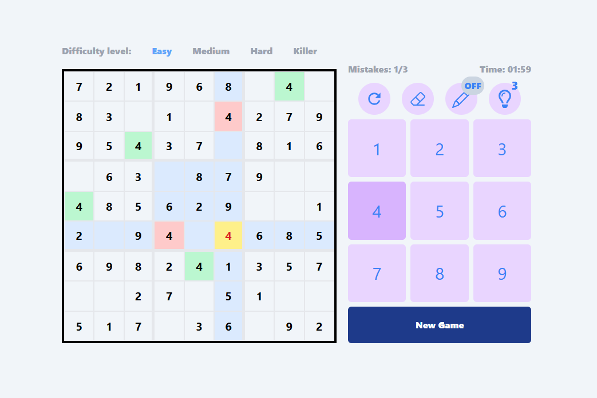

## 🌐 Website
https://sudoku-2fua.onrender.com

## ✍️ Description
The Sudoku App is a web-based game that allows users to play classic Sudoku in a clean interface. Built with React and Tailwind CSS, it focuses on modular design and user-friendly components.

⚠️ Note: This app is currently designed for desktop use only and is not optimized for mobile devices.

## ⚙️ Installation

### Copy repository: 
```bash
git clone https://github.com/0H3rY0/Sudoku.git
```

### Start aplication:

```bash
cd client
```

```bash
npm install
```

```bash
npm run dev
```

## 🖼️ Illustrative photos


## ⌨️ Technologies
- **React**
- **Tailwind CSS**
- **Radix UI Dialog**
- **React Icons**

